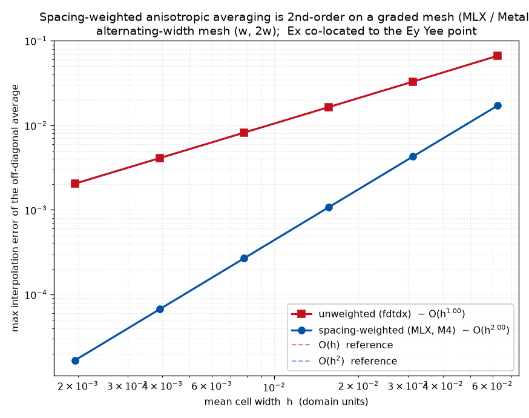

# FDTDMEX

**A macOS-native (MLX / Metal) fork of [fdtdx](https://github.com/ymahlau/fdtdx) — forward-first FDTD on Apple Silicon.**

FDTDMEX is a **fork of fdtdx** (the JAX FDTD Maxwell solver) that adds a native **MLX** backend so the *forward* time loop runs on the **Metal GPU with unified memory**. On Apple Silicon a forward `run_fdtd` automatically routes to the MLX engine; everywhere else (and for gradients /
inverse design) it runs the unchanged JAX engine. You keep fdtdx's entire mature front end — geometry, GDS, constraints, sources, detectors, boundaries — and import it the same way:

```python
import fdtdx   # this fork; the MLX backend is built in
```

> **Status — forward engine complete (M1–M4), validated element-wise vs JAX.** The MLX forward engine handles isotropic / diagonal / **full-tensor (9-component) anisotropic** materials, electric & magnetic conductivity (lossy), CPML **and periodic** boundaries, point-dipole + (tilted) Gaussian/uniform **TFSF plane sources**, and Energy / Field / Poynting / Phasor detectors — on uniform **and non-uniform (rectilinear) grids** with spacing-weighted operators (2nd-order on graded meshes). Each surface is cross-checked element-wise against the JAX reference on CPU. Remaining work is dispersion (ADE), the mode solver, subpixel smoothing, and orchestration — see [docs/roadmap.md](docs/roadmap.md).

## Why a Mac fork

Most differentiable FDTD tooling is built on JAX, whose **Metal backend is unusable** on macOS (no JIT). The strongest case for Apple Silicon here is **memory, not just compute**: a fully-anisotropic simulation stores a 3×3 permittivity *tensor per voxel* — ~9× the isotropic
footprint — which saturates the VRAM of a single CUDA GPU. Apple's **unified memory** (up to 512 GB) lets the GPU address the whole domain with no host↔device streaming. FDTDMEX leans into that, while **inverse design stays on CUDA/JAX clusters** (it needs cluster-scale parallelism).

Design priorities:
- **Forward simulation on Metal**, race-free via MLX's functional / out-of-place updates.
- **Full-tensor anisotropic, heterogeneous materials** are natively supported.
- **Non-uniform grids done right** — spacing-weighted curl + interpolation, 2nd-order on graded meshes (see [docs/nonuniform-grid.md](docs/nonuniform-grid.md)), with convergence rate confirmed: 
- **Zero divergence from fdtdx semantics** so results cross-check element-wise against the JAX reference, and improvements can flow back upstream.

## How the backend routing works

The injection point is the whole forward loop (you can't interleave JAX tracing and MLX eager execution): on a supported forward run, the field/material arrays are bridged to MLX once, a pure-MLX Python time loop runs, and the results (fields + `detector_states`) are bridged back — so all downstream code (detector reading, plotting, S-params) is unchanged.

- **Auto:** on Apple Silicon, a forward-only `run_fdtd` whose features are supported runs on MLX; otherwise it falls back to JAX (warned once). On non-Apple platforms `mlx` isn't installed and everything runs on JAX.
- **Force a backend** (required for validation — the JAX oracle runs on CPU):

  ```python
  with fdtdx.use_backend("jax"):   # force the JAX engine (CPU reference)
      ref = fdtdx.run_fdtd(arrays, objects, config)
  with fdtdx.use_backend("mlx"):   # force the Metal engine
      out = fdtdx.run_fdtd(arrays, objects, config)
  ```

  or set `FDTDMEX_BACKEND=mlx|jax` in the environment.

The MLX engine lives in [`src/fdtdx/mlx/`](src/fdtdx/mlx) and the dispatch in [`src/fdtdx/backend/`](src/fdtdx/backend); the only edit to upstream's forward path is a 4-line guarded hook in `run_fdtd`.

## Install

Use [`uv`](https://docs.astral.sh/uv/). On **Apple Silicon** you get the Metal backend; on other platforms it installs as plain fdtdx (JAX).

```bash
uv sync                 # core (jax + the fdtdx stack; mlx is auto-installed on Apple Silicon)
uv sync --extra dev     # + pytest / ruff / docs tooling
uv sync --extra viz     # + plotly / pyvista / trame
```

## Quickstart

A point dipole radiating in vacuum with absorbing (CPML) boundaries — runs on Metal on a Mac, on JAX elsewhere:

```python
import jax
import jax.numpy as jnp
import fdtdx

config = fdtdx.SimulationConfig(grid=fdtdx.UniformGrid(spacing=50e-9), time=120e-15, dtype=jnp.float32)
objects, constraints = [], []

volume = fdtdx.SimulationVolume(partial_real_shape=(3e-6, 3e-6, 3e-6))
objects.append(volume)

bdict, clist = fdtdx.boundary_objects_from_config(
    fdtdx.BoundaryConfig.from_uniform_bound(thickness=10), volume
)
constraints += clist
objects += list(bdict.values())

source = fdtdx.PointDipoleSource(
    partial_grid_shape=(1, 1, 1),
    wave_character=fdtdx.WaveCharacter(wavelength=1e-6),
    polarization=2,
)
constraints.append(source.place_at_center(volume, axes=(0, 1, 2)))
objects.append(source)

energy = fdtdx.EnergyDetector(name="energy", reduce_volume=True, plot=False)
constraints += [energy.same_size(volume, axes=(0, 1, 2)), energy.place_at_center(volume, axes=(0, 1, 2))]
objects.append(energy)

key = jax.random.PRNGKey(0)
oc, arrays, params, config, _ = fdtdx.place_objects(object_list=objects, config=config, constraints=constraints, key=key)
arrays, oc, _ = fdtdx.apply_params(arrays, oc, params, key)

_, arrays = fdtdx.run_fdtd(arrays=arrays, objects=oc, config=config, key=key)  # MLX on Apple Silicon
print(arrays.detector_states["energy"]["energy"].shape)
```

## Relationship to upstream

This repo is a git fork: `upstream` is `ymahlau/fdtdx`, so `git merge upstream/main` stays clean and MLX features can be PR'd back. The MLX backend is additive (new `src/fdtdx/{backend,mlx}` packages plus a tiny `run_fdtd` hook); the rest of the tree tracks fdtdx. `src/fdtdmex` is a thin brand alias that re-exports `fdtdx`.

## Workstreams

| | Workstream | Summary |
|---|---|---|
| **WS-A** | Forward MLX engine | Curl, E/H update (isotropic → full-anisotropic), CPML + periodic boundaries, sources, detectors, time loop; spacing-weighted on non-uniform grids. **Complete (M1–M4), validated element-wise vs JAX.** |
| **WS-B** | Mode solver | 2D-Yee full-vectorial FD eigensolver + mode overlap; TFSF injection. |
| **WS-C** | Subpixel smoothing | Kottke/Farjadpour effective-tensor averaging as a host pre-step feeding WS-A. |
| **WS-D** | Orchestration | Declarative config, MCP server, git-like history, locally-hosted web UI. |

See [docs/architecture.md](docs/architecture.md) and [docs/roadmap.md](docs/roadmap.md).

## License & attribution

This fork inherits fdtdx's **MIT** lineage; the project's own additions are provisionally **Apache-2.0** (see [LICENSE](LICENSE), [NOTICE](NOTICE), [docs/licensing.md](docs/licensing.md) — final licensing is owner-managed). It also consults **MEEP** (GPL) for subpixel-smoothing and near-to-far-field math (referenced, not copied without provenance).
