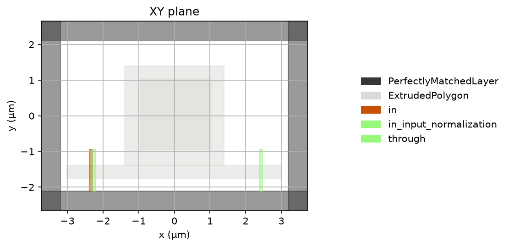
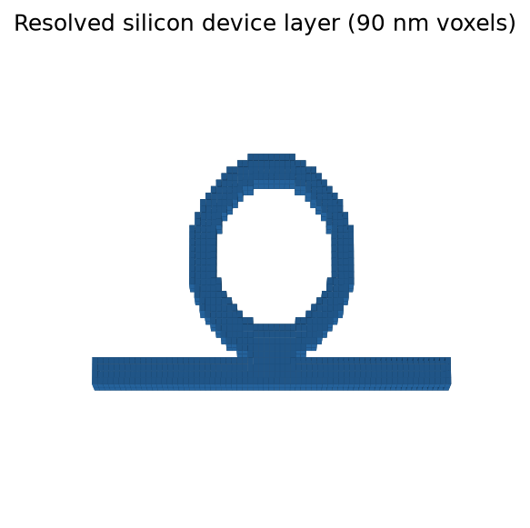
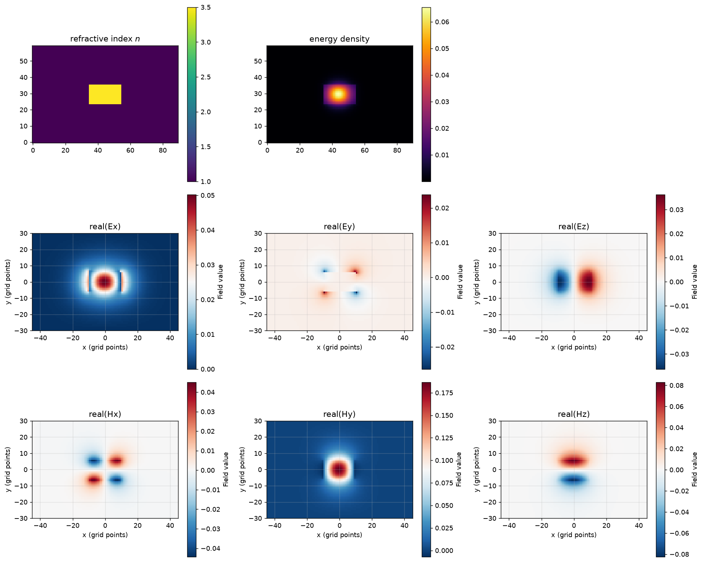
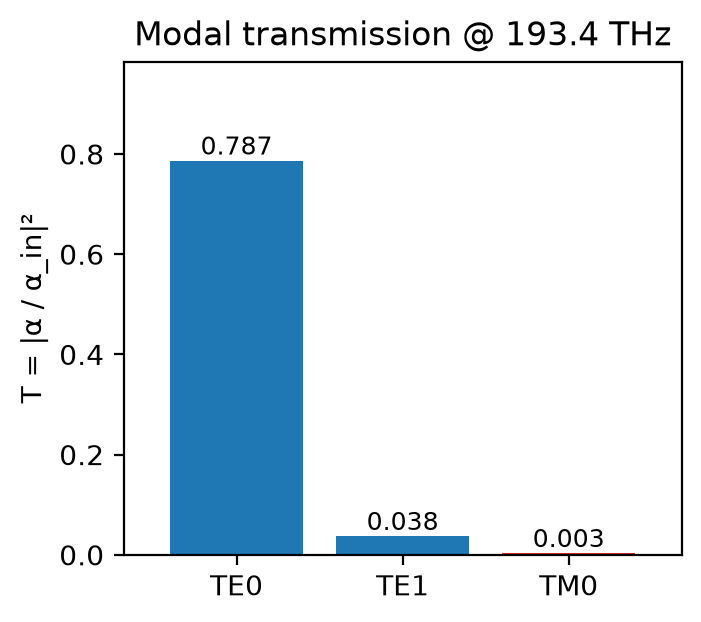
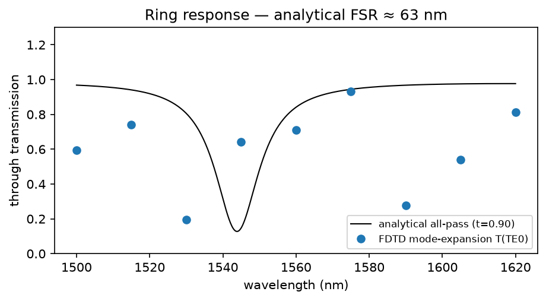

# FDTDMEX

**A macOS-native (MLX / Metal) fork of [fdtdx](https://github.com/ymahlau/fdtdx) — forward FDTD on Apple Silicon.**

FDTDMEX is a **fork of fdtdx** (the JAX FDTD Maxwell solver) that adds a native **MLX** backend so the
*forward* time loop runs on the **Metal GPU with unified memory**. You keep fdtdx's entire mature front
end — geometry, GDS, constraints, materials, sources, detectors, boundaries — and import it the same way:

```python
import fdtdx   # this fork; the MLX backend is built in
```

On Apple Silicon a supported forward `run_fdtd` **automatically** routes to the Metal engine; everywhere
else (and for gradients / inverse design) it runs the unchanged JAX engine, so results cross-check
element-wise against the JAX reference.

## Status

The forward engine is **complete, fast, and validated element-wise vs JAX-CPU**, and a native mode solver,
a notebook front end, and a portable HDF5 hand-off are in place. **The plan for the next phase lives in
[ACTION_PLAN.md](ACTION_PLAN.md).**

**What FDTDMEX adds over fdtdx**
- **Native Metal/MLX forward backend** on Apple Silicon — iso/diagonal forward simulations run **~6.5–7× faster than JAX-CPU** and the lead grows (no plateau) with resolution. Full anisotropy, lossy + 9-tensor conductivity, CPML / periodic / PEC-PMC boundaries, and Drude–Lorentz dispersion all run on Metal.
- **Unified-memory capacity** — the GPU addresses the whole domain with no host↔device streaming, so large/heterogeneous domains that saturate a discrete GPU's VRAM still fit.
- **2nd-order accurate non-uniform (graded) grids** — spacing-weighted curl, interpolation, and off-diagonal averaging; *more correct* than upstream, which leaves the off-diagonal average unweighted (1st-order).
- **Native full-vectorial mode solver** (no Tidy3D dependency), a **mode-expansion monitor**, a `Scene` facade with interactive **3D visualization**, and a **portable HDF5 contract** (`sim_init` → `sim_run` → `sim_postproc`) for remote / agent-driven runs.

**Not on Metal yet → transparently falls back to JAX**
- Gradients / inverse design (by design — the MLX backend is forward-only; inverse design stays on JAX/CUDA).
- Mode sources / detectors route the forward time loop to JAX (the native mode solver they call is done).
- Bloch / complex (nonzero-k) propagation; dispersive / randomized plane sources.
- Non–Apple-Silicon platforms (everything runs on JAX).

## Why a Mac fork

Differentiable FDTD tooling is built on JAX, whose **Metal backend is unusable** on macOS (no JIT) — so
on a Mac, fdtdx runs on CPU. FDTDMEX closes that gap by running the forward time loop **natively on
Metal via MLX**. The strongest case for Apple Silicon here is **memory, not just compute**: a
fully-anisotropic simulation stores a 3×3 permittivity tensor *per voxel* (~9× the isotropic footprint),
which saturates the VRAM of a single discrete GPU. Apple's **unified memory** (up to 512 GB) lets the GPU
address the whole domain directly. FDTDMEX leans into that for large *forward* runs, while **inverse
design stays on CUDA/JAX clusters** (it needs cluster-scale parallelism).

**What stays compatible.** The backend is purely additive — the same `import fdtdx`, the same front end,
the same object/constraint API, the same `run_fdtd`. On a supported forward run the field/material arrays
are bridged to MLX once, a pure-MLX time loop runs, and the results (fields + `detector_states`) bridge
back **unchanged**, so all downstream code (detector reading, plotting, S-parameters) is identical. Every
supported feature is checked element-wise against the JAX engine, and improvements can flow back upstream.

## Performance & accuracy

**Scaling — MLX/Metal vs JAX-CPU** (M4 Pro, 500 steps). MLX leads for every N ≥ 64 across isotropic and
diagonal materials, with **no plateau** as the grid grows: **~6.5–7.1× faster than JAX-CPU at N ≥ 128**
— e.g. isotropic at N=192 reaches **≈1.39 GCell·steps/s** vs ≈0.20 on JAX-CPU. The forward update runs
at the memory-bandwidth floor.


**Non-uniform (graded) grids — 2nd-order accurate.** FDTDMEX's spacing-weighted operators converge at
2nd order on graded meshes (measured slope ≈ 2.0), versus 1st order for an unweighted average.


See [docs/performance.md](docs/performance.md) and [docs/nonuniform-grid.md](docs/nonuniform-grid.md) for
the methodology and numbers.

## How the backend routing works

The injection point is the **whole forward loop** (you can't interleave JAX tracing and MLX eager
execution), via a small guarded hook in `run_fdtd`.

- **Auto (default):** on Apple Silicon, a forward-only `run_fdtd` whose features are all supported runs on
  MLX; anything unsupported (see Status) falls back to JAX, warned once. On other platforms `mlx` isn't
  installed and everything runs on JAX.
- **Force / disable a backend:**
  ```python
  with fdtdx.use_backend("jax"):   # disable MLX — force the JAX engine (also the CPU reference oracle)
      ref = fdtdx.run_fdtd(arrays, objects, config)
  with fdtdx.use_backend("mlx"):   # force the Metal engine (raises if the case is unsupported)
      out = fdtdx.run_fdtd(arrays, objects, config)
  ```
  or set `FDTDMEX_BACKEND=mlx|jax` in the environment.

**For fdtdx developers — what gets routed *out* of the JAX engine:** only a supported **forward** run on
Apple Silicon is handled by the MLX engine ([`src/fdtdx/mlx/`](src/fdtdx/mlx)); the routing decision lives
in [`src/fdtdx/backend/`](src/fdtdx/backend). Everything else — gradients/inverse design, the unsupported
forward features listed in Status, and all non-Apple platforms — stays on the **unchanged JAX engine**.
The only edit to upstream's forward path is a ~4-line guarded hook in `run_fdtd`; the rest of the tree
tracks fdtdx.

## Install

Use [`uv`](https://docs.astral.sh/uv/). On **Apple Silicon** you get the Metal backend; on other platforms
it installs as plain fdtdx (JAX).

```bash
uv sync                 # core (jax + the fdtdx stack; mlx is auto-installed on Apple Silicon)
uv sync --extra dev     # + pytest / ruff / docs tooling
uv sync --extra viz     # + plotly / pyvista / trame
```

## Quickstart

A plane wave transmitted through an isotropic dielectric slab, with absorbing (CPML) boundaries. This is
a **high-resolution 3-D run** (≈240³ cells) — exactly the regime where the Metal engine is ~6.5–7× over
JAX-CPU on a Mac (raise the resolution and the lead grows). Runs on Metal on Apple Silicon, on JAX
elsewhere — no code change.

```python
import jax
import jax.numpy as jnp
import fdtdx

config = fdtdx.SimulationConfig(grid=fdtdx.UniformGrid(spacing=25e-9), time=150e-15, dtype=jnp.float32)
constraints, objects = [], []

# Vacuum volume with absorbing (PML) boundaries on all faces.
volume = fdtdx.SimulationVolume(partial_real_shape=(6e-6, 6e-6, 6e-6))
objects.append(volume)
bdict, clist = fdtdx.boundary_objects_from_config(
    fdtdx.BoundaryConfig.from_uniform_bound(thickness=10, boundary_type="pml"), volume)
constraints += clist
objects += list(bdict.values())

# An isotropic dielectric slab (ε = 12) spanning the transverse plane.
slab = fdtdx.UniformMaterialObject(
    partial_grid_shape=(None, None, None),
    partial_real_shape=(6e-6, 6e-6, 0.6e-6),
    material=fdtdx.Material(permittivity=12.0),
)
constraints.append(slab.place_at_center(volume, axes=(0, 1, 2)))
objects.append(slab)

# A plane source launching a 1.55 µm wave toward the slab (+z).
source = fdtdx.UniformPlaneSource(
    partial_grid_shape=(None, None, 1),
    partial_real_shape=(6e-6, 6e-6, None),
    fixed_E_polarization_vector=(1, 0, 0),
    wave_character=fdtdx.WaveCharacter(wavelength=1.55e-6),
    direction="+",
)
constraints.append(source.place_relative_to(
    volume, axes=(0, 1, 2), own_positions=(0, 0, 0), other_positions=(0, 0, -0.6)))
objects.append(source)

# Transmitted Poynting flux on a plane past the slab.
flux = fdtdx.PoyntingFluxDetector(
    name="T", direction="+", reduce_volume=True, partial_grid_shape=(None, None, 1))
constraints += [flux.same_size(volume, axes=(0, 1)),
                flux.place_relative_to(volume, axes=(2,), own_positions=(0,), other_positions=(0.6,))]
objects.append(flux)

key = jax.random.PRNGKey(0)
oc, arrays, params, config, _ = fdtdx.place_objects(
    object_list=objects, config=config, constraints=constraints, key=key)
arrays, oc, _ = fdtdx.apply_params(arrays, oc, params, key)

_, arrays = fdtdx.run_fdtd(arrays=arrays, objects=oc, config=config, key=key)  # Metal on Apple Silicon
print(arrays.detector_states["T"])   # transmitted flux vs time
```

## Showcase — a silicon ring resonator

The notebook [`examples/ring_resonator_demo/`](examples/ring_resonator_demo/) walks a complete
photonic-IC workflow end to end. It runs on a deliberately **coarse 90 nm grid** so every cell finishes in
seconds — the figures below are illustrative, not converged.

| Layout (objects + ports) | Resolved geometry (90 nm voxels) |
|---|---|
|  |  |

**Author → see → run → inspect.** Draw the device in **gdstk** (GDS) → convert to fdtdx geometry → view it
in 2D and interactive **3D** (`plot_setup_3d`) → solve and inject the bus **mode** → recover the
through-port response as a **mode expansion** (transmission per waveguide mode = S-parameters):

| Injected bus mode | Mode-expansion transmission |
|---|---|
|  |  |

**Analytical verification.** The mode solver matches the exact symmetric-slab dispersion to ~2×10⁻⁴, and
the ring's resonance spacing is checked against the analytical free spectral range `FSR = λ²/(n_g·L)`:



**Portable hand-off.** `sim_init(scene) → config.hdf5` packs the resolved arrays; `sim_run(config.hdf5) →
results.hdf5` runs them on the Metal engine (or a GPU-free mock); `sim_postproc` reduces them to the small
quantities an agent or remote client reads. Regenerate the figures with
[`examples/ring_resonator_demo/make_showcase_images.py`](examples/ring_resonator_demo/make_showcase_images.py).

## Showcase — O-band carrier-depletion microring modulator

[`examples/ring_mrm_oband/`](examples/ring_mrm_oband/) is a self-contained design-verification of an
**O-band (1310 nm) carrier-depletion microring modulator**, forward-simulated on the **Metal** engine. It
authors a racetrack ring + bus, solves the bus TE₀ mode, **converges the mesh from 40 nm to 20 nm**, then
reports the cold through-port `T(λ)` (resonance, loaded Q, extinction ratio) with `|E|²` field maps showing
light trapped in the ring on resonance, the coupling control (ER vs bus–ring gap), and a Soref–Bennett
static electro-optic resonance shift vs reverse bias. To stay on Metal it uses a broadband **Gaussian**
source + **phasor monitors** with a standing-wave-immune **net-Poynting two-run** transmission. Script and
figures live together in the folder; see its [README](examples/ring_mrm_oband/README.md) to run it.

## Relationship to upstream

This repo is a git fork: `upstream` is `ymahlau/fdtdx`, so `git merge upstream/main` stays clean and MLX
features can be PR'd back. The MLX backend is additive (new `src/fdtdx/{backend,mlx}` packages plus the
tiny `run_fdtd` hook); the rest of the tree tracks fdtdx. `src/fdtdmex` is a thin brand alias that
re-exports `fdtdx`.

## Workstreams

| | Workstream | Status |
|---|---|---|
| **WS-A** | Forward MLX engine (curl, E/H update, boundaries, sources, detectors, time loop; Metal kernels at the bandwidth floor) | **Complete** — full forward surface + performance phases, validated element-wise vs JAX |
| **WS-B** | Native full-vectorial mode solver + mode-expansion monitor | **Complete** — straight waveguides, isotropic + diagonal anisotropy; matches analytic slab dispersion |
| **WS-C** | Subpixel smoothing (effective-tensor averaging) | Core complete — validated; auto-application during placement is pending |
| **WS-D** | Front end + portable workspace — `Scene`, 3D viz, config schema, HDF5 hand-off, MCP server, web UI | **In progress** — `Scene` + `plot_setup_3d`, `SceneModel`, and the `sim_init`/`sim_run`/`sim_postproc` HDF5 contract are done; MCP server + web UI next |

Build order and the active plan: [ACTION_PLAN.md](ACTION_PLAN.md); longer arc: [docs/roadmap.md](docs/roadmap.md).

## License & attribution

This fork inherits fdtdx's **MIT** lineage; the project's own additions are provisionally **Apache-2.0**
(see [LICENSE](LICENSE), [NOTICE](NOTICE), [docs/licensing.md](docs/licensing.md) — final licensing is
owner-managed). It also consults **MEEP** (GPL) for subpixel-smoothing and near-to-far-field math
(referenced, not copied without provenance).
