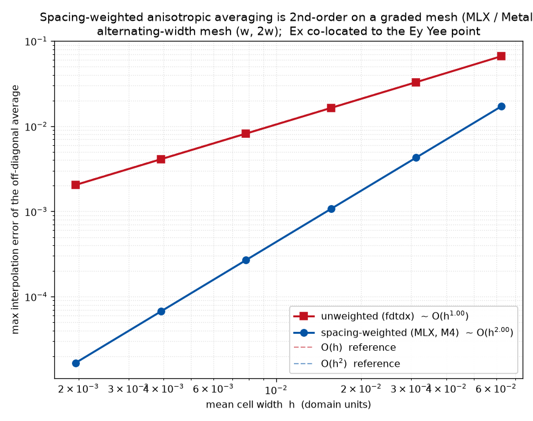

# Non-Uniform Grids (spacing-weighted operators)

**Design requirement, not an afterthought.** FDTDMEX treats graded/non-uniform grids as first-class. A plain *unweighted* 4-point mean for the anisotropic off-diagonal averaging is only 1st-order accurate on stretched grids; we carry per-axis **Yee cell-size arrays** through the engine and use **spacing-weighted** finite differences and interpolation, keeping the curl *and* the anisotropic coupling 2nd-order on graded meshes. This off-diagonal averaging fix was **originated in this project and contributed upstream — merged into fdtdx as #378** — so upstream's JAX path and this fork now both carry it (the MLX engine mirrors it element-for-element).

> **Implemented and validated.** The MLX engine threads per-axis cell widths through the curl (metric-scaled differences), the detector interpolation, and the anisotropic off-diagonal average, with the widths precomputed once on the host. On a uniform grid every weighted form reduces *exactly* to a plain unweighted average (verified element-wise). The off-diagonal average is **2nd-order on a graded mesh** where an unweighted average is only 1st-order — measured convergence slopes **2.00 (weighted) vs 1.00 (unweighted)**:
>
> 

## Grid representation

A rectilinear non-uniform grid is defined by **edge coordinates** per axis: `x_edges`, `y_edges`, `z_edges`. From these derive:
- **primal spacings** `Δ_i = edges[i+1] − edges[i]` (cell sizes), and
- **dual spacings** `Δ̃_i = (Δ_i + Δ_{i-1}) / 2` (distances between cell centers / Yee duals).

The E and H components, being staggered by half a cell, "see" different spacings (primal vs dual) along each direction. The grid object must expose both as 1-D arrays per axis (broadcastable into `(Nx,Ny,Nz)`), plus cell volumes and face areas for energy/flux integrals.

## Spacing-weighted curl

A derivative `∂f/∂x` across a face is `(f[i+1] − f[i]) / Δ_x` using the **local** spacing for that location (primal for one field, dual for the other), not a global constant. Implement curl as finite differences divided by the appropriate per-axis spacing array (broadcast), e.g.

```
(∂H_z/∂y − ∂H_y/∂z)  with  ∂H_z/∂y = (roll(H_z, -1, y) − H_z) / Δ̃_y[None,:,None]
```

(exact primal/dual assignment follows the Yee staggering in [physics.md](physics.md)).

## Spacing-weighted interpolation (off-diagonal anisotropy)

To place component `E_b` at the location of component `E_a`, interpolate using **distance weights** from the cell-size arrays rather than a plain mean. For a target at fractional position between two samples separated by spacings `Δ⁻, Δ⁺`, the linear weight is `w⁺ = Δ⁻/(Δ⁻+Δ⁺)` (and symmetrically), generalized to the 4-point (bilinear) stencil as a product of per-axis weighted 1-D interpolations. On a uniform grid these weights reduce to ¼ each (recovering FDTDX's average); on a graded grid they restore 2nd-order accuracy.

The same weighted interpolation is applied to all six cross-terms in both the E and H anisotropic updates.

## Conductivity & coefficients

The conductivity→coefficient scaling and any spacing-dependent normalization use the **local** cell size rather than a single global resolution.

## Validation

Convergence is measured at **2nd order on a graded mesh** (error ∝ Δ²) for both the curl on an analytic field and a birefringence/walk-off case exercising the off-diagonal interpolation; an unweighted average shows up as 1st-order on the same test.

## Override regions and the graded grid

A rectilinear grid can be written out by hand (`RectilinearGrid.custom`), but the usual request is
"small cells here, background cells elsewhere". `GradedGrid` is the policy that turns that request
into a grid, and `RefinementRegion` is the request.

```python
import fdtdx

grid = fdtdx.GradedGrid(
    spacing=50e-9,                                   # background cell width
    regions=(
        fdtdx.RefinementRegion(spacing=12.5e-9, z=(-100e-9, 900e-9)),   # target width in a box
    ),
    max_ratio=1.4,                                   # largest neighbouring-width ratio
)
config = fdtdx.SimulationConfig(grid=grid, time=120e-15)
volume = fdtdx.SimulationVolume(partial_real_shape=(200e-9, 200e-9, 4e-6))
```

A region is a box in **physical coordinates**, in the same absolute frame as `RealCoordinateConstraint`:
the domain is centred on the policy's `center`, so `0` is the middle of the simulation volume. Each
axis is an `(lower, upper)` pair in metres or `None` for the whole axis, and `spacing` is one target
width or one per axis. Where regions overlap, the finest target wins; a region asking for cells
coarser than the background is ignored.

### How the policy is resolved

`UniformGrid.resolve(shape)` takes a cell count, because on a uniform grid the count and the extent
are the same statement. On a graded grid the count is an *output* of the mesh generator, so
`GradedGrid` is resolved from the physical extent instead: it carries `resolve_extent(real_shape)`,
and `place_objects` calls it with the simulation volume's `partial_real_shape`. `resolve(shape)`
raises rather than guessing. The `UniformGrid` and `QuasiUniformGrid` paths are untouched, and a
volume given only a `partial_grid_shape` raises a message saying to give it a metric extent.

The resolved grid is a plain `RectilinearGrid`, pinned onto the config before constraint solving, so
everything downstream — placement, PML, detectors, the CFL step — sees one realized mesh. The time
step therefore comes from the finest realized cell, not from the background.

### The generation rule

Per axis, the generator works on a continuous **cell width field** `s(x)`:

- inside a region, `s` is that region's *realized* width: the target reduced just enough that a
  whole number of cells fills the region exactly;
- away from every region, `s` grows by `ln(max_ratio)` per metre of distance from the nearest one,
  capped at the background width;
- `s` is the pointwise minimum of those contributions.

The growth rate is the continuous form of geometric grading: a width field with Lipschitz constant
`ln(max_ratio)` induces a cell sequence whose neighbours differ by at most `max_ratio`. The axis is
then cut at every coordinate where the requested width changes, and each stretch is filled with
cells of equal *cell measure* `∫ dx / s`, so those boundaries always land on cell edges and the
extent stays exact. A stretch holds a whole number of cells, so its measure is rounded — to the
nearest whole number, or up when rounding to nearest would push a cell past that stretch's own
target. The leftover length is absorbed by every cell of the stretch through one common factor
rather than by a single last cell, which is why the widest background cell in the example below
comes out at 49.85 nm rather than 50 nm. Where a rounding leaves a cell too small next to its
neighbour across a boundary, a repair pass widens it again at the expense of the rest of its own
stretch, never past that stretch's target.

Four properties hold on every axis of the result:

1. every cell inside a region is at most that region's target,
2. neighbouring widths differ by at most `max_ratio`,
3. every boundary where the requested width changes lands exactly on a cell edge,
4. the edges span the requested extent exactly.

With no regions the policy reproduces `UniformGrid` cell for cell.

`GradedGrid.summary(real_shape)` prints what came out, and `place_objects` logs it:

```
GradedGrid: background 50 nm, 1 refinement region(s), max ratio 1.4, 3,520 cells total
  x: 4 cells, width 50 nm .. 50 nm, largest neighbour ratio 1.000
  y: 4 cells, width 50 nm .. 50 nm, largest neighbour ratio 1.000
  z: 220 cells, width 12.5 nm .. 49.85 nm, largest neighbour ratio 1.399
  ratio bound honoured
```

### Worked example

A plane wave through an `eps = 4` half space, each grid run twice (slab and vacuum) so the
transmission is a flux ratio at the same detector — see
[`examples/graded_grid_slab/`](../examples/graded_grid_slab/):

| grid | z cells | T | vs fine |
| --- | --- | --- | --- |
| coarse, 50 nm | 80 | 0.876847 | 1.11e-02 |
| fine, 12.5 nm | 320 | 0.887917 | — |
| graded, 50 nm + 12.5 nm region | 220 | 0.888307 | 3.90e-04 |
| Fresnel `4n/(1+n)²` | | 0.888889 | |

The refinement covers the whole slab, not only the interface. The wavelength inside `eps = 4` is
half the vacuum one, so the 50 nm background leaves 10 cells per wavelength there; ending the region
just past the detector instead measured `T = 0.8959`, a 0.8 % bias from the grading transition
sitting inside the high-index medium.

### Limits of this stage

- **No automatic per-material sizing.** Regions are placed by hand. Deriving them from each
  material's refractive index — the thing the worked example had to do manually — is
  [issue #34](https://github.com/Jinge-Wang/FDTDMEX/issues/34).
- **Refinement is per axis.** A rectilinear grid cannot refine a box without refining the slabs it
  projects onto, so a compact region produces fine *slabs* along all three axes. Give a region a
  per-axis `spacing` when only one axis should be refined.
- **Very short stretches cannot be graded.** A stretch of less than about one cell between a region
  and the domain edge, or between two regions, leaves no room for the transition and
  `resolve_extent` raises, naming the axis and the coordinate. Widen or move the region, make it a
  whole number of its own cells wide, or raise `max_ratio`.
- **Size objects by their two faces, not by a length.** On any non-uniform grid a single
  `partial_real_shape` length is converted to a cell count using the cells at the domain's lower
  corner, which are not the cells the object sits on. Pin both faces with one
  `RealCoordinateConstraint` carrying `sides=("-", "+")`. The placement report prints the requested
  metric extent next to the placed box, so a mismatch is visible.
