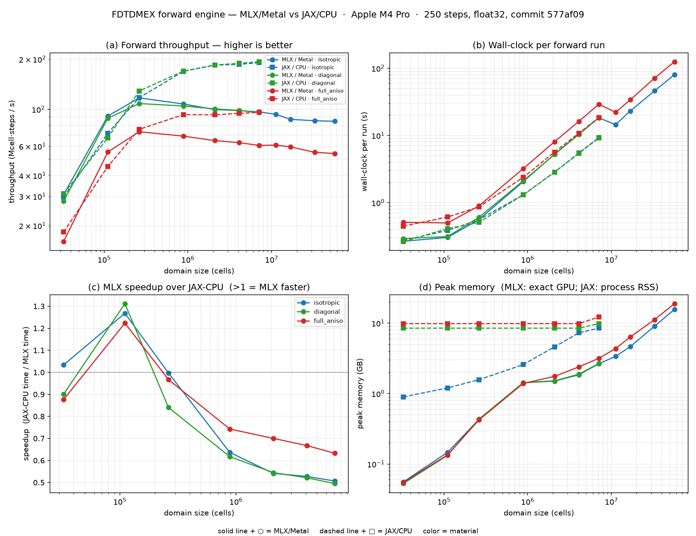

# Forward-engine performance baseline — MLX/Metal vs JAX-CPU (eager engine)

**Status:** baseline measured (this is the *eager* engine, before the `mx.compile` pass).
**Machine:** Apple **M4 Pro**, 52 GB unified memory. **mlx** 0.31.2, **jax** 0.10.1, Python 3.12,
float32, commit `577af09`.
**Harness:** [`benchmarks/bench_forward.py`](../benchmarks/bench_forward.py) →
[`benchmarks/plot_results.py`](../benchmarks/plot_results.py). Methodology:
[`perf-eval-plan.md`](perf-eval-plan.md).


Each cell is a cubic domain (cells = N³) uniformly filled with one material, CPML on all sides, a
point-dipole source, no detector (pure update loop). Both backends run the **identical placed
case**, forced with `fdtdx.use_backend(...)`. The same cases are validated element-wise between the
two backends in `tests/validation/`, so both are computing the same FDTD — only the timing differs.

**Device split confirmed (asserted at harness startup):** MLX → `Device(gpu, 0)` (Metal GPU),
JAX → `cpu:0`. JAX-Metal is unusable; JAX always runs on CPU on this machine.

---

## 1. Headline result

> **In the current eager engine on the M4 Pro, MLX/Metal does *not* beat JAX-CPU at scale.** MLX is
> competitive at small–medium domains, but its throughput **plateaus** while JAX-CPU's jit-compiled
> `lax.scan` keeps scaling, so JAX-CPU is ~**2× faster at large domains**. This is the baseline the
> `mx.compile` optimization must beat — and it quantifies why that work is the top forward-perf
> lever.

Representative sweep (**250 steps**, median of 2 timed runs after warmup), throughput in
**Mcell·steps/s** (= cells·steps / s), and **MLX peak GPU memory**:

| material | N | cells | MLX Mcs/s | JAX Mcs/s | MLX/JAX speedup | MLX peak |
|---|--:|--:|--:|--:|:--:|--:|
| isotropic | 48 | 0.11 M | 91.0 | 71.8 | **1.27×** | 0.15 GB |
| isotropic | 64 | 0.26 M | 117.2 | 117.5 | 1.00× | 0.43 GB |
| isotropic | 96 | 0.88 M | 107.6 | 169.1 | 0.64× | 1.42 GB |
| isotropic | 128 | 2.10 M | 99.7 | 184.2 | 0.54× | 1.50 GB |
| isotropic | 192 | 7.08 M | 96.6 | 190.6 | 0.51× | 2.65 GB |
| diagonal | 192 | 7.08 M | 95.6 | 193.2 | 0.49× | 2.68 GB |
| full_aniso | 48 | 0.11 M | 55.4 | 45.3 | **1.22×** | 0.13 GB |
| full_aniso | 96 | 0.88 M | 69.0 | 92.9 | 0.74× | 1.39 GB |
| full_aniso | 128 | 2.10 M | 64.9 | 92.7 | 0.70× | 1.75 GB |
| full_aniso | 192 | 7.08 M | 60.7 | 95.9 | 0.63× | 3.17 GB |

Full tables: `benchmarks/results/matched_s250.jsonl` (250 steps) and `matched.jsonl` (60 steps);
regenerate the figure with `uv run python benchmarks/plot_results.py benchmarks/results/matched_s250.jsonl`.

---

## 1a. Why does MLX plateau at ~100 Mcell·steps/s? (root-cause analysis)

> **Superseded in part by [metal-bottleneck-analysis.md](metal-bottleneck-analysis.md)** (GPU-measured,
> not inferred). *Confirmed:* the plateau is **redundant memory traffic**, not bandwidth (engine ≈99
> full-array DRAM round-trips/step when ~5–8 are needed). *Corrected:* the roofline is the **measured
> 240 GB/s** (not 273); the **"deeper ceiling = `(3,N,N,N)` layout"** claim below is **wrong** —
> component-last measures **1.00×**; the real post-`compile` limit is the **carried CPML ψ** traffic
> (compile fuses ~37 RT then stalls at ~62, because ψ is loop-carried state). And there is **no memory
> advantage** over JAX-CPU (footprints ~equal to N=384). See that doc for the fix ordering.

97 Mcell·steps/s is **not** the M4 Pro's memory roofline. A minimally-fused FDTD step moves ~8
arrays/cell-step (read+write E and H, read ε), so 97 Mcs/s of *useful* work is only **~9 GB/s — ~3%
of the 273 GB/s** bus. The GPU shows "100% utilization" in Activity Monitor because it **is** busy —
but busy moving **redundant** data across dozens of unfused kernels, not saturating bandwidth with
useful work. Measured decomposition (step-level microbench, since superseded by
`benchmarks/profile_engine.py`'s real-engine 2×2; N=192):

| step variant (N=192) | Mcell·steps/s | note |
|---|--:|--:|
| real `update_E`+`update_H`, **CPML on** (current engine) | **104** | ≈ the observed plateau |
| real `update_E`+`update_H`, CPML off | 141 | full-domain CPML costs **1.36×** |
| bare curl+update, eager, pad+roll | 294 | drops the metric/ψ/stack overhead |
| bare curl+update, eager, slice-diff (no pad) | 388 | per-step padding costs ~1.3× |
| bare curl+update, **`mx.compile`**, slice-diff | **443** | fusion + no pad |

So the same math, lean and compiled, runs **~4.3× faster (104 → 443)** than the current engine — and
*even that* uses only ~50 GB/s, i.e. it is still **not** bandwidth-bound (see "deeper ceiling"
below). The plateau is overhead, not physics. Ranked causes, all in the per-step hot path:

1. **Redundant elementwise work on the uniform/interior grid (~2× — biggest, cheapest to fix).**
   In [`curl.py`](../src/fdtdx/mlx/curl.py) every finite difference is multiplied by the metric
   scale (`* my_`), which is the scalar **1.0 on a uniform grid** — 12 full-array multiply-by-1
   kernels per step. The curl combine multiplies by `inv_kappa` (=1 outside the PML) and adds ψ
   (=0 outside the PML), and `mx.stack([...6 ψ...])` **rebuilds a (6,N,N,N) array every step even
   when boundaries are off**. Each of these is a separate full-domain Metal kernel doing a DRAM
   round-trip for a no-op. (Measured: 141 → 294, ~2.1×, is exactly this overhead.)
2. **`mx.compile` not used (~1.4×).** The loop is eager
   ([`loop.py`](../src/fdtdx/mlx/loop.py) is a plain Python `for` with `mx.eval` every 8 steps), so
   each op is its own kernel and intermediates stream to DRAM. `mx.compile` fuses the
   diff→metric→ψ→curl→update chain so intermediates stay in registers/threadgroup memory.
3. **Per-step full-field padding (~1.3×).** [`pad_fields_mlx`](../src/fdtdx/mlx/curl.py) does 3
   sequential `mx.pad` calls (a full-array copy each) **per field per step** — 6 full copies/step of
   pure data movement, then the curl `roll`s the padded array (6 more copies) and slices it back.
   Computing differences by slicing (`f[1:] - f[:-1]`) removes the pad entirely.
4. **Full-domain CPML (1.36×, and it grows with N).** ψ_E/ψ_H (12 × N³ arrays) and the a/b
   recurrence run over **every** cell, but a=b=0 except in the ~8-cell PML slabs. At N=192 the
   interior is ~77% of cells doing zero-valued ψ math. This is *why the plateau doesn't improve with
   N* — the wasted fraction rises as the domain grows. Restrict ψ to the 6 boundary slabs.

**What I ruled out (it is *not* these):**
- **No per-step CPU↔GPU ping-pong.** The source plan stores `coeff`/`on_steps` as **host numpy**
  ([`source_freeze.py`](../src/fdtdx/mlx/source_freeze.py)), so `float(coeff[n])` /
  `bool(on_steps[n])` in [`inject.py`](../src/fdtdx/mlx/inject.py) are host-only — no device sync.
  The only sync is `mx.eval` every 8 steps and one array bridge per `run_fdtd` call.
- **Not the array bridge.** Host↔device transfer + the numpy CPML precompute happen **once per
  `run_fdtd`**, not per step — confirmed by the step-count test (60→250 steps did not lift the
  plateau). It *does* inflate very short runs; a persistent `MLXState` (build once, step many, bridge
  out once) would amortize it for the multi-thousand-step runs real FDTD needs.
- **Not raw bandwidth.** Even the lean compiled step uses ~50 GB/s of 273.

**Deeper ceiling (beyond ~4×).** The lean compiled variant still only reaches ~50 GB/s because the
`(3, N, N, N)` component-leading layout with `roll`/interior-slice access is **strided /
uncoalesced**, and MLX op-level fusion can't merge a stencil's neighbor reads the way a hand-written
kernel can. Lifting past ~4× would need a custom fused Metal stencil kernel (`mx.fast` / a Metal
kernel) and/or a component-last (`N, N, N, 3`) layout for coalesced access — a larger change that
breaks byte-for-byte fdtdx parity, so it's a later lever, not the first one.

**Expected payoff.** Fixes 1–4 are independent and compose to ~3–4×, putting MLX at ~300–440
Mcs/s — **comfortably above JAX-CPU's ~190** at large N, including full_aniso. Start with #1 (trivial
scalar guards) and #2 (`mx.compile`), measure, then #3/#4.

---

## 2. The load-bearing questions (perf-eval-plan §7.2)

### MLX-vs-JAX-CPU crossover size
At representative step counts the **crossover is ~N=64–96 (≈0.26–0.9 M cells)**. Below it MLX is
slightly ahead (up to ~1.3× at N=48); above it JAX-CPU pulls ahead, reaching ~**2×** by N=192 for
iso/diagonal and ~**1.6×** for full_aniso.

⚠️ **Step-count sensitivity (don't be misled by short runs).** At **60 steps**, MLX appeared to win
**2.7–3.9×** at small N — but that gap is largely **JAX's own per-call overhead** (jit dispatch +
Python), which amortizes at higher step counts. Going 60→250 steps, JAX isotropic N=96 throughput
rose 94→169 Mcs/s while **MLX did not move** (94→108). Always benchmark at a representative step
count (≥200); FDTD runs are thousands of steps.

### Does eager per-step overhead dominate? (→ how much can `mx.compile` buy?)
Two distinct effects, both pointing at `mx.compile`:

1. **Small-N: launch/dispatch overhead.** MLX isotropic throughput climbs 30.7 → 117 Mcs/s from
   N=32 → 64, then plateaus — i.e. at small N the eager per-step cost (Python loop + per-op Metal
   kernel launches + the periodic `mx.eval`) dominates and the GPU is starved.
2. **Large-N: no fusion → memory-traffic amplification.** MLX's throughput **plateaus at ~97 Mcs/s
   (iso) / ~61 (full_aniso)** and never reaches JAX-CPU's ~190 even at 7 M cells. The engine is
   *functional / out-of-place*: every stencil step allocates many intermediate `(3, N, N, N)` arrays
   and each eager op is a separate Metal kernel doing a **full DRAM round-trip**. On the M4 Pro's
   shared memory bus this caps throughput below a fused implementation.

`mx.compile` attacks both: it removes per-step Python/launch overhead **and** fuses the stencil ops
so intermediates stay in registers/threadgroup memory instead of streaming to DRAM. **Expect the
largest gains exactly where the eager engine is worst — large domains** — i.e. `mx.compile` should
lift the plateau, not just the small-N tail. This baseline is the control to measure that against.

### How does the full-tensor anisotropic case scale (vs isotropic), in time and memory?
- **Time:** full_aniso runs at ~**0.6×** the isotropic throughput (the per-cell analytic 3×3 A/B
  algebra), consistently across sizes (e.g. N=192: 60.7 vs 96.6 Mcs/s). Notably, full_aniso is the
  case where **MLX is *least* behind JAX-CPU** (0.63× vs 0.49× for diagonal at N=192): the heavier
  per-cell compute shifts the kernel from bandwidth- toward compute-bound, which favors the GPU.
  This is the regime the project most cares about.
- **Memory:** full_aniso peak GPU memory is **~1.2–1.8× the isotropic footprint** at equal N (the
  9-component ε tensor + the A/B temporaries), e.g. N=192: 3.17 vs 2.65 GB. It scales cleanly with
  no blow-up.

### Largest domain that fit (the unified-memory claim)
MLX-only large-domain sweep (`benchmarks/results/mlx_large.jsonl`, 120 steps), pushing past where
JAX-CPU is practical (the MLX plateau extends across the whole range; JAX stops at N=192):




| material | N | cells | MLX peak | throughput |
|---|--:|--:|--:|--:|
| isotropic | 224 | 11.2 M | 3.37 GB | 93.3 Mcs/s |
| isotropic | 256 | 16.8 M | 4.63 GB | 87.0 Mcs/s |
| isotropic | 320 | 32.8 M | 9.05 GB | 85.4 Mcs/s |
| isotropic | 384 | 56.6 M | 15.63 GB | 84.7 Mcs/s |
| **full_aniso** | 224 | 11.2 M | 4.35 GB | 61.0 Mcs/s |
| **full_aniso** | 256 | 16.8 M | 6.35 GB | 59.5 Mcs/s |
| **full_aniso** | 320 | 32.8 M | 11.19 GB | 55.2 Mcs/s |
| **full_aniso** | 384 | 56.6 M | 18.86 GB | 54.3 Mcs/s |

Two things to read off this:

1. **The MLX throughput plateau is real, not a memory-pressure artifact** — it holds flat from
   ~0.3 M cells all the way to **56.6 M cells** (iso 96→85, full_aniso 61→54 Mcs/s; the slight droop
   is the larger working set falling out of cache). So `mx.compile`'s headroom is genuine.
2. **A 56.6 M-cell full-tensor anisotropic sim runs on one Mac in 18.9 GB**, with no host↔device
   streaming. Memory scales cleanly/linearly (~0.28 GB/M-cells iso, ~0.33 full_aniso) and never
   blew up; the ceiling is just total RAM.

The point is **capacity, not speed**. A full-tensor material stores a 3×3 ε *tensor* per voxel — its
**permittivity storage is ~9× the isotropic case** — which is what can saturate a single discrete
GPU's VRAM. (Total sim memory here is only ~1.2× isotropic, because the dynamic E/H/ψ fields
dominate the footprint and are material-independent; the 9× hits the material arrays specifically,
and grows with heterogeneity.) Apple's **unified memory** lets the Metal GPU address the whole domain
directly, so the ceiling is total RAM (52 GB here, up to 512 GB on an M-series Ultra), not a separate
VRAM budget. This capacity advantage is **orthogonal** to the throughput comparison above.

---

## 3. Caveats

- **Hardware balance (important).** The M4 Pro pairs a *modest* GPU with a *strong* multicore CPU,
  both sharing one ~273 GB/s memory bus. That is roughly the worst case for "GPU beats CPU." On an
  M-series **Max/Ultra** (the realistic target for large forward sims on a Mac: far more GPU cores
  and 400–800 GB/s bandwidth) the balance shifts substantially toward MLX. **These numbers are M4
  Pro-specific**; re-run the harness on the target machine.
- **JAX memory in the figure is a coarse proxy.** In single-process mode `ru_maxrss` is a monotonic
  process high-water mark (polluted by the MLX cells run in the same process), so panel (d)'s JAX
  line is *not* a clean per-case peak. The **MLX line (exact `mx.get_peak_memory`) is trustworthy**.
  For a clean per-case JAX RSS, run with `--isolate` (subprocess per cell).
- **Timing includes the per-call array bridge** (host↔device transfer + host-side CPML precompute
  inside `run_fdtd`). This is a fixed per-call cost; it does *not* explain the large-N plateau
  (raising steps 60→250 didn't lift MLX throughput), but it does inflate MLX wall-clock at very low
  step counts. A future persistent-state design would amortize it.
- **full_aniso uses a modest off-diagonal (0.5).** Strong off-diagonals are numerically unstable in
  the explicit anisotropic update in *both* backends (roadmap "Quirk A"), unrelated to performance.

## 4. Next

- **`mx.compile` the per-step body** ([roadmap.md](roadmap.md) WS-A "next"): the measured top lever.
  Pass `time_step` + amplitude scalars as compiled args, keep source/detector gating host-side, fuse
  the curl→update→CPML stencil. Re-run **this same harness** and compare against
  `matched_s250.jsonl`. Target: lift the large-N plateau above JAX-CPU.
- Optional CUDA comparison for full_aniso on the inverse-design target hardware, to frame the
  unified-memory capacity argument quantitatively against a discrete-GPU VRAM ceiling.

## 5. Reproduce

```bash
uv run python benchmarks/bench_forward.py \
    --backends mlx,jax --materials isotropic,diagonal,full_aniso \
    --sizes 32,48,64,96,128,160,192 --steps 250 --repeats 2 \
    --out benchmarks/results/forward.jsonl
uv run python benchmarks/plot_results.py benchmarks/results/forward.jsonl
```
