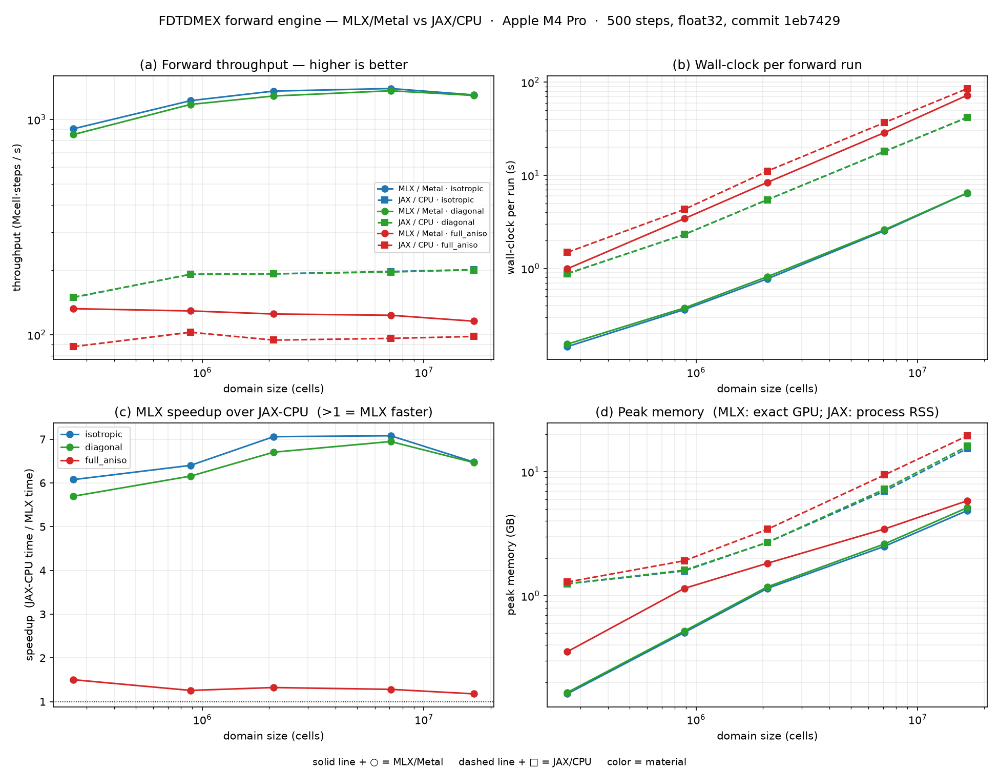

# Performance — roofline, model, and current results

Measured reference for the MLX/Metal forward engine on Apple Silicon. fp32 throughout.

## Current scaling (M4 Pro)

`benchmarks/results/scaling_s500.jsonl` (500 steps, warmup excluded → steady-state wall-clock).
This sweep is the **Phase-1 default path** (MLX-op cores, CPML on; the M2 Metal-kernel path is the RT
table + History below, not yet a full scaling sweep).
**MLX/Metal leads JAX-CPU for every N ≥ 64 across all three materials, with no plateau:**

| material | MLX Mcs/s (N=256) | JAX-CPU | speedup | crossover |
|---|--:|--:|--:|--:|
| isotropic | 266.8 | 194.7 | 1.37× | N≈64 |
| diagonal | 267.6 | 196.3 | 1.36× | N≈64 |
| full_aniso | 120.9 | 96.5 | 1.25× | N≈48–64 |

Below N≈48 JAX-CPU wins (MLX kernel-launch overhead dominates tiny domains). Panel (d) memory: MLX
peak is exact; the JAX line is in-process RSS (use `benchmarks/profile_memory.py` for a clean
per-cell figure).

## Roofline (M4 Pro, `benchmarks/profile_metal.py`)

- **Coalesced copy: 240 GB/s = 88% of the 273 GB/s spec** — the real ceiling (the spec is not
  achievable; 240 is the denominator for all roofline math).
- Component-leading `(3,N,N,N)` vs component-last `(N,N,N,3)` stencil: **1.00×** — no coalescing
  penalty from the layout.
- `roll`-diff vs slice-diff on the engine's `y − shift(y)` pattern: **0.89–1.13×** — `roll` is not a
  culprit.

## The round-trip (RT) model

FDTD is memory-bandwidth-bound. **1 RT = read+write of one `(3,N³)` field**; per-step time ≈
`RT × 170 MB / 240 GB/s` at N=192. The bottleneck is redundant traffic — too many full-array passes,
not arithmetic, dispatch-starvation, or layout (confirmed by toggling CPML, which removes exactly the
carried-ψ RT, and by `profile_engine.py`'s eager-vs-compiled × CPML 2×2).

| engine state (N=192 iso) | Mcs/s | RT/step |
|---|--:|--:|
| original (pad+roll, full-domain CPML) | 105 | ~99 |
| + pad-free slice-diff (eager) | 130 | 77 |
| + `mx.compile` E/H cores | 211 | 47 |
| + slab-CPML (Phase-1 default, MLX-op cores, CPML-on) | **277** | **36** |
| compiled MLX-op cores, CPML off (op-graph ceiling) | 473 | 21 |
| + Metal kernel (M2), CPML on (spatial-hybrid slab correction) | 374 | 27 |
| **+ Metal kernel (M3, CPML folded in), CPML on (default-on)** | **1826** | **5** |
| **+ Metal kernel, CPML off** | **2219** | **5** |
| necessary floor (read E,H + materials; write E,H) | ~3150¹ | ~3 |

¹ the M1 standalone microbench ([`benchmarks/m1_kernel.py`](../benchmarks/m1_kernel.py)) at the bare
read-once/write-once floor; the in-engine M2 CPML-off number (2219) is that floor discounted for
source injection + detector recording.

The MLX-op path is stuck near its op-graph ceiling at ~21–36 RT (op fusion can't keep a stencil's
working set on-chip or merge neighbour reads). A custom Metal kernel reaches the bandwidth floor:
**M2 landed those kernels in the engine** ([`phase2-metal-kernels.md`](phase2-metal-kernels.md),
[`src/fdtdx/mlx/kernels.py`](../src/fdtdx/mlx/kernels.py)) behind `FDTDMEX_METAL_KERNEL`. CPML-off hit
the floor (4.5× over the op path); CPML-on was **1.31×** because the M2 spatial-hybrid slab-CPML
correction (`_slab_add`) rebuilt full component arrays via `concatenate` (~22 RT on top of the 5 RT
bulk). **M3 folds CPML into the kernel** (`_corr_blocks`: per-slab-thread ψ recurrence + correction,
the compact slab ψ + per-axis `a/b/1κ` as in/out buffers), dropping that rebuild — **CPML-on 374 →
1826 Mcs/s, 27 → 5 RT (4.9×), at the bulk floor**. M3 also added in-kernel non-uniform metric and a
block hybrid for full-tensor inclusions (heterogeneous 125 → 1124 Mcs/s), then flipped
`FDTDMEX_METAL_KERNEL` **default-on** (`=0` forces the MLX-op path).

## Metal vs CPU/JAX — two factors

CPU and GPU share one DRAM, so speedup is not "GPU flops":
- **(a) bandwidth-utilization gap (~1.4×, chip-dependent).** GPU sustains ~85% of rated unified BW;
  a multicore CPU sustains ~55–65% and caps at a per-die ceiling (~240 GB/s). This is the measured
  1.37× on M4 Pro at equal traffic; it widens only where rated BW outruns the CPU (top-bin Max,
  Ultra).
- **(b) traffic gap (chip-independent, the real prize).** JAX/XLA on CPU does not tile the stencil
  (effective traffic ~tens of RT, like the pre-Phase-1 engine). A fused Metal kernel at the ~5–8 RT
  floor adds up to ~4× on top of (a) — *if* JAX stays traffic-heavy (measured in Phase 2 M1).

## History (what was tried, what it bought, what didn't work)

Chronological, so the reasoning is reproducible. All N=192 iso on one M4 Pro; "default" = MLX-op
cores, CPML on. Numbers are the canonical figures above.

- **Phase 1 — fix the eager plateau (default 105 → 277 Mcs/s, 2.6×).** Three independent levers,
  each a measured RT drop: drop per-step `mx.pad` for pad-free slice-diff curl; wrap the E/H cores in
  `mx.compile` (fuse the elementwise chain, 47 RT); confine CPML to boundary slabs (slab-CPML, 36 RT).
  *Didn't move the needle:* component-last `(N,N,N,3)` layout (1.00×, no coalescing penalty),
  `roll`-vs-slice diff (≤1.13×). The op graph then plateaus at ~21–36 RT — fusion can't keep the
  stencil working set on-chip.
- **Phase 2 M1 — go/no-go microbench (3150 Mcs/s, 3 RT, 5.8× over MLX-ops, bit-exact).** A standalone
  hand Metal kernel for the iso-uniform interior ([`benchmarks/m1_kernel.py`](../benchmarks/m1_kernel.py))
  reaches the bandwidth floor the op graph can't. Confirmed factor (b) is large → proceed.
- **Phase 2 M2 — kernels in the engine (CPML-off 2219 Mcs/s / 5 RT, 4.5×; CPML-on 374 / 27, 1.31×).**
  The M1 kernel generalised to per-cell materials (iso + diagonal) and non-cubic domains, with CPML as
  a *spatial hybrid*: the kernel does the full-domain bulk; the thin PML slabs get an additive MLX-op
  correction. Behind `FDTDMEX_METAL_KERNEL` (default off), validated element-wise vs the JAX oracle.
  - *What didn't work / lessons:* (1) **running the kernel cores eager** — the slab-CPML correction's
    many small ops dispatch one-by-one and the CPML-on step came out *slower than the op path* (250
    vs 285 Mcs/s); `mx.compile`-ing the whole core (the metal kernel composes as a graph node) fixed
    it (→374). (2) The slab correction's `_slab_add` rebuilds full component arrays via `concatenate`,
    so CPML-on still pays ~22 RT on top of the 5 RT bulk — this is the open CPML-on gap, to be closed
    in M3 by folding CPML into the kernel for slab cells. (3) The M1 kernel hard-coded a cubic `N`;
    real domains are not cubic (per-axis Nx/Ny/Nz was required).
- **Phase 2 M3 — CPML folded in + coverage widened + default-on (CPML-on 374 → 1826 Mcs/s, 5 RT,
  4.9×).** Three independent wins, each parity-gated (`test_mlx_kernel.py`: kernel-vs-ops rel < 1e-4,
  vs-JAX rel < 1e-3):
  - **CPML fold** — `_corr_blocks` runs the per-slab-thread ψ recurrence + κ-stretch/ψ correction
    *inside* the bulk kernel (the compact slab ψ + per-axis `a/b/1κ` passed as extra in/out buffers),
    so the kernel writes the final E/H. Dropped the M2 `_slab_add` `concatenate` rebuild → CPML-on
    fell from 27 RT to the 5 RT bulk floor (1826 Mcs/s iso, 1711 diag). *With CPML folded in there is
    no longer an op-chain in the core, so `mx.compile` is no longer load-bearing for the common path
    (it still helps the block-hybrid splice).*
  - **Non-uniform metric in-kernel** — each difference scaled by its per-axis `m{k}` buffer; the
    non-uniform iso/diag path now rides the kernel at the same ~5 RT floor.
  - **Block hybrid for full-tensor inclusions** — kernel does the diagonal bulk; the off-diagonal
    inclusion bbox gets the MLX-op aniso update over a haloed interior slice, spliced back. N=128 8³
    inclusion **125 → 1124 Mcs/s (9.0×)** vs the whole-domain aniso path. *Tried/decided:* the block
    (bbox) hybrid was chosen over the per-cell in-kernel 3×3 branch — it reuses the validated aniso
    ops and is bit-identical on box cells; per-cell branch (general but parity-risky) is left for
    scattered/smoothed-interface domains. Gated lossless + uniform + compact interior; else full ops.
  - `FDTDMEX_METAL_KERNEL` flipped **default-on** (`=0` opts out); full validation suite green
    default-on (20 passed).

Per-chip ceilings and the Apple-Silicon table: `phase2-metal-kernels.md` §8.
