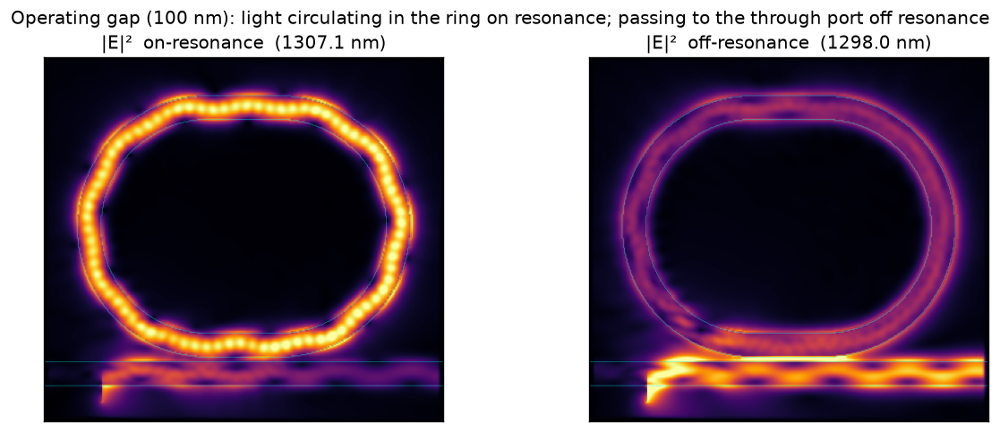

# ring_mrm_oband — O-band carrier-depletion microring modulator

Self-contained design-verification of an **O-band (1310 nm) silicon microring modulator (MRM)**, forward-simulated on the **Metal** engine (MLX backend). Everything for this example — script and artifacts — lives in this folder.

```
ring_mrm_oband/
├── ring_mrm_oband.py      # the study (percent-format; run as a script or paired with the notebook)
├── ring_mrm_oband.ipynb   # executed notebook with inline figures (jupytext-paired with the .py)
├── figures/               # generated figures + operating_point.npz
└── README.md
```

## What it does

1. **Model + mode** — racetrack ring + bus authored in gdstk; bus **TE₀** mode → `n_eff`, `n_g`, `Γ`, and the geometry's reference resonance `λ_ref = n_eff·L/m`.
2. **Mesh convergence** — cold spectrum from **40 nm down to 20 nm**; resonance λ and loaded Q vs grid.
3. **Cold run** — through-port `T(λ)` at the production grid: the resonance (dip nearest `λ_ref`), loaded Q, and extinction ratio.
4. **Coupling** — through-port `T(λ)` vs bus–ring gap and the ER-vs-gap trend (the coupling regime).
5. **Static EO** — Soref–Bennett free-carrier perturbation → resonance red-shift vs reverse bias.

The `|E|²` field maps (light circulating in the ring on resonance vs passing through off resonance) are rendered separately at the **operating gap (100 nm)** by the standalone [`field_maps_100nm.py`](field_maps_100nm.py) — see [Field maps](#field-maps-operating-gap) below.

## Method (why)

Mode sources/detectors would force the slow JAX/CPU path here, so the cold run uses a broadband **Gaussian** source + **phasor monitors** and reports the standing-wave-immune **net Poynting flux** with a bus-only reference, `T(λ) = P_thru^ring / P_thru^bus`. The FDTD device is a full-etch **strip** (clean, affordable); the rib SOI stack is implicit in the mode/EO analysis where the lateral PN junction lives.

## Resolution & runtime

Starting mesh guideline: `λ/(n_eff·15) ≈ 1310/(2.69·15) ≈ 32 nm`; production sign-off at **20 nm**. The MLX time loop is eager, so wall time scales with cells × steps: a 40 nm run is ~5 min, a **20 nm run is ~1–1.5 h**. The full suite (convergence 40→20 + cold + gap sweep + EO) is **several hours**, and the operating-gap field map is a separate ~25 min run — run it deliberately (e.g. overnight), or coarsen `GAP_RES` / drop a convergence point to trade accuracy for time.

These are **current-engine** wall times. The bulk update already runs at the Metal memory-bandwidth floor, so the next gains must beat the memory wall itself: **deeper engine optimization** — interior temporal blocking, per-subdivision material compaction, and monitor-traffic reduction — is a planned next focus alongside the agentic workflow, targeting a much larger speedup. See [dev-docs/roadmap.md](../../dev-docs/roadmap.md).

## Run

```bash
# quick coarse smoke (physics meaningless, exercises the whole code path in ~5 min):
MRM_FAST=1 uv run --extra viz python examples/ring_mrm_oband/ring_mrm_oband.py

# production (writes figures/ + operating_point.npz; several hours at 20 nm):
uv run --extra viz python examples/ring_mrm_oband/ring_mrm_oband.py
```

Tunable knobs at the top of the script: `CONV_RES`, `PROD_RES`, `GAP_RES`, `GAPS`, `BAND`, `SETTLE`, device geometry (`R`, `WG`, `LC`).

To regenerate the executed notebook (the form checked in here), convert and run the percent script:

```bash
cd examples/ring_mrm_oband
uv run --with jupytext jupytext --to notebook ring_mrm_oband.py            # → ring_mrm_oband.ipynb
uv run --with nbconvert jupyter nbconvert --to notebook --execute --inplace \
  --ExecutePreprocessor.timeout=-1 ring_mrm_oband.ipynb                    # ~5 h at 20 nm
```

## Results (production run, 20 nm)

Mode: `n_eff = 2.69`, `n_g = 3.94`, `Γ_core = 0.95`. Cold through-port at the 180 nm gap: `λ_res ≈ 1305 nm`, loaded `Q ≈ 125`, `ER ≈ 4.8 dB`, `FSR ≈ 23 nm`. Gap sweep (25 nm grid, gaps 0.10 → 0.42 µm) shows a clean coupling trend — ER falls monotonically from **8.5 dB @ 100 nm** (deepest, the operating gap) to 0.8 dB @ 420 nm as the ring under-couples (see *Coupling regime* below for why). Static EO (Soref–Bennett, optical-only): monotonic **red** shift, **≈ 62 pm/V** (Δλ ≈ +370 pm at 6 V reverse bias).

## Coupling regime — why ER rises as the gap *shrinks*

A natural first guess is that a wider gap gives a deeper, cleaner resonance. For this device it is the opposite, and the reason is standard ring physics.

This is an **all-pass (notch) ring**: a single bus, one through port, no drop port. The on-resonance through-port power is

`T_min = (a − t)² / (1 − a·t)²`,

set by two *independent* quantities — the **self-coupling** `t` (the field amplitude that stays in the bus, controlled by the **gap**: a smaller gap couples more, so `t` is smaller) and the **round-trip amplitude** `a` (the fraction of field surviving one lap, fixed by the ring's loss and **independent of the gap**). Extinction is deepest at **critical coupling**, `t = a`, where `T_min → 0`; moving off it fills the notch back in, on either the under-coupled (`t > a`) or over-coupled (`t < a`) side.

Fitting the swept results (`T_min` and loaded Q per gap) gives `t ≈ 0.78 → 0.97` as the gap grows 100 → 420 nm, against a gap-independent `a ≈ 0.52`. So the ring is **under-coupled across the entire sweep**, and widening the gap drives `t → 1` (decoupled), *further* from `t = a`. ER therefore **falls** with gap and the deepest notch is at the **smallest** gap — to raise ER you shrink the gap *toward* critical coupling, not widen it.

Two things make this easy to misread. (1) Loaded **Q rises** with gap (≈200 → 262), because weaker coupling means less coupling loss and a longer photon lifetime — but Q (linewidth) and ER (depth) are different knobs; a high-Q under-coupled ring is *narrow but shallow*. (2) This compact racetrack (R = 2.5 µm) is very lossy at O-band (`a² ≈ 0.27`, ~73 % round-trip power loss, loaded Q only ~200), so critical coupling would need `κ² ≈ 0.73` — a gap **below 100 nm**, outside the swept range. A larger, lower-loss ring (or extending the sweep to sub-100 nm gaps) would show the textbook ER-peaks-then-falls shape.

## Field maps (operating gap)



`|E|²` at the silicon-core mid-plane for the **operating gap (100 nm)** — the deepest-extinction point of the sweep, where trapping is clearest. On resonance the light **circulates inside the ring** (the bright lobes are the resonant standing-wave antinodes) while the bus dims; off resonance the ring is dark and the wave **passes straight through the bus**. Generated by the standalone [`field_maps_100nm.py`](field_maps_100nm.py) (one ~25 min Metal run at the **25 nm gap-sweep grid**). It records the through-port spectrum and the in-plane field at the same wavelengths, then reads on/off-resonance straight off the spectrum — **on-resonance = the through-port dip (≈1307 nm, the same resonance `gap_sweep.png` shows)** and **off-resonance = the transmission peak (≈1298 nm)** — so the field map and the gap sweep use one consistent definition of resonance.

**Convergence caveat.** Across 40 → 20 nm the resonance position does *not* fully settle — the tracked dip moves within ~±4 nm (1311 / 1314 / 1311 / 1305 nm at 40 / 32 / 25 / 20 nm) and loaded Q drifts (≈197 → 125). This compact racetrack at O-band is **not grid-converged at 20 nm**; the numbers above are the as-run 20 nm values, reported honestly rather than extrapolated. Tighter convergence would need a finer mesh (≤15 nm) and/or a longer settle — out of scope for this demo.

## Method details & validation notes

The recipe below is what makes this run physically convincing while staying on Metal.

- **Stay on Metal.** Mode sources/detectors force the slow JAX/CPU path (JAX here is CPU-only — no jax-metal), so excitation is a broadband `GaussianPlaneSource` (TE: E along the width y) read by `PhasorDetector` monitors; both are MLX-eligible with non-dispersive Si/oxide.
- **Transmission = two-run net Poynting flux.** `T(λ) = P_thru^ring / P_thru^bus-only`, with the per-frequency net flux `½·Re ∮(E×H*)·n̂` from the recorded phasors. Net power (not `|mode-overlap|²`) avoids the standing-wave `T>1` artifact; the bus-only reference cancels the Gaussian launch's radiative loss (baseline → ~1). The ring must settle ~3–3.5 ps — a high-Q ring needs a long ring-down.
- **Geometry.** The FDTD device is a full-etch **strip** ring (clean, affordable); the rib SOI stack is implicit in the mode/EO analysis. The inner-ring carve material is **oxide** (the background is oxide). The bus–ring `gap` is in metres while `R`/`WG` are in µm, so the bus-to-ring-centre spacing is `CY = WG + gap·1e6 + R`. The source/monitor box (W=1.2, H=0.5 µm) sits strictly inside the interior; a PML grid-tiling retry grows the volume by a cell (x **and** y) until `place_objects` resolves.
- **Resonance fit.** Band edges are excluded (low pulse power → spurious half-dips) and the dip **nearest `λ_ref`** is fitted, so the same resonance is tracked across grids and gaps; the baseline is the capped max over the central band.
- **Electro-optic.** Reverse bias removes carriers → silicon index **up** → resonance **red**-shift. `Δn_eff = 0.5·Δn_bulk(ND,NA)·[Γ(W(V)/2) − Γ(W0/2)]` (the 0.5 is abrupt-junction symmetry); `Γ(half_w)` interpolates the **cumulative** modal energy (smooth — a hard cell mask at the 10 nm mode grid would staircase). O-band Soref–Bennett coefficients. This is an **optical-only** prediction — not RF/thermal/ transient.

**Acceptance criteria.** Convergence: resonance λ and Q should settle toward 20 nm (and where they don't, that is reported, not faked). Cold `T(λ)`: a clean dip near `λ_ref` with baseline ~1. Field maps: energy clearly **inside the ring** on resonance and **passing through** off resonance. Gap sweep: ER varies with gap (coupling control), operating gap = max ER. EO: a monotonic **red** shift of plausible magnitude (tens of pm/V), explicitly optical-only.

**Pitfalls already handled** (so they aren't rediscovered). Earlier coarse 40 nm runs were not converged (resonance moved ~½ FSR between 40/48/60 nm) — hence the 40→20 nm sweep. Bugs fixed in the script: the mode unit (confined strip vs slab; `WG*1e-6`); x–y vs **y–z** cross-section labeling; monitors poking into the PML; **oxide-vs-air** ring interior; the resonance metric grabbing band edges; the **gap being a no-op** (a µm/m mix); the placement retry missing the y-axis; and the EO sign (red shift), magnitude (0.5 junction factor), and staircase (cumulative-Γ interpolation).
