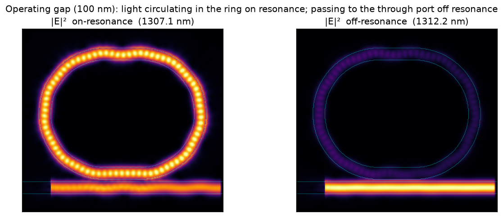

# ring_mrm_oband — O-band carrier-depletion microring modulator

Self-contained design-verification of an **O-band (1310 nm) silicon microring modulator (MRM)**, forward-simulated on the **Metal** engine (MLX backend). Everything for this example — script and artifacts — lives in this folder.

```
ring_mrm_oband/
├── ring_mrm_oband.py      # the study (percent-format; run as a script or paired with the notebook)
├── ring_mrm_oband.ipynb   # executed notebook with inline figures (jupytext-paired with the .py)
├── figures/               # generated figures (+ operating_point.npz, gitignored)
└── README.md
```

## What it does

1. **Model + mode** — racetrack ring + bus authored in gdstk; bus **TE₀** mode → `n_eff`, `n_g`, `Γ`, and the geometry's reference resonance `λ_ref = n_eff·L/m`.
2. **Mesh convergence** — cold spectrum from **40 nm down to 20 nm**; resonance λ and loaded Q vs grid.
3. **Cold run** — through-port `T(λ)` at the production grid: the resonance (dip nearest `λ_ref`), loaded Q, and extinction ratio.
4. **Coupling** — through-port `T(λ)` vs bus–ring gap and the ER-vs-gap trend (the coupling regime).
5. **Static EO** — Soref–Bennett free-carrier perturbation → resonance red-shift vs reverse bias.

The `|E|²` field maps (light circulating in the ring on resonance vs passing through off resonance) are rendered separately at the **operating gap (100 nm)** by the standalone [`field_maps_100nm.py`](field_maps_100nm.py) — see [Field maps](#field-maps-operating-gap) below.

## Method (why)

Mode sources/detectors would force the slow JAX/CPU path here, so the cold run uses a broadband **Gaussian** source + **phasor monitors** and reports the standing-wave-immune **net Poynting flux** with a bus-only reference, `T(λ) = P_thru^ring / P_thru^bus`. The FDTD device is a full-etch **strip** (clean, affordable); the rib SOI stack is implicit in the mode/EO analysis where the lateral PN junction lives.

## Resolution & runtime

Starting mesh guideline: `λ/(n_eff·15) ≈ 1310/(2.69·15) ≈ 32 nm`; production sign-off at **20 nm**. The MLX time loop is eager, so wall time scales with cells x steps. Measured 2026-09-04 on an Apple M4 Pro (24 GB, macOS 26.5.1), single forward run of this scene:

| grid | domain (cells) | wall / run |
|---|---|---|
| 40 nm | 216 × 199 × 36 | 76 s |
| 32 nm | 266 × 245 × 41 | 159 s |
| 25 nm | 336 × 309 × 48 | 372–384 s |
| 20 nm | 416 × 382 × 56 | 796–802 s |

The full suite (convergence 40→20 + cold + gap sweep + EO) took **4659 s (78 min)** end to end, and the operating-gap field map is a separate **381 s (6.4 min)** run — or coarsen `GAP_RES` / drop a convergence point to trade accuracy for time.

Every time above is measured, not extrapolated, and all of them are **after the monitor-recording optimization** (region-restricted interpolation + activity-gating + DFT auto-subsampling), which cut monitored runs ~3.9× from the earlier engine: the same suite took ~5 h when the checked-in notebook was first executed on the pre-optimization engine, and the field map went ~25 min → 6.4 min. The bulk update already runs at the Metal memory-bandwidth floor; the next gains must beat the memory wall itself, via a **tiled sub-floor engine** — interior temporal blocking bound to per-tile material compaction — see [dev-docs/performance-roadmap.md](../../dev-docs/performance-roadmap.md).

## Run

```bash
# quick coarse smoke (physics meaningless, exercises the whole code path in ~2 min):
MRM_FAST=1 uv run --extra viz --with ipython python examples/ring_mrm_oband/ring_mrm_oband.py

# production (writes figures/ + operating_point.npz; 78 min at 20 nm on an M4 Pro):
uv run --extra viz --with ipython python examples/ring_mrm_oband/ring_mrm_oband.py
```

`--with ipython` is needed only for the last cell's inline `Image(...)` display; without it the script
raises `ModuleNotFoundError: IPython` after every figure has already been written.

Tunable knobs at the top of the script: `CONV_RES`, `PROD_RES`, `GAP_RES`, `GAPS`, `BAND`, `SETTLE`, device geometry (`R`, `WG`, `LC`).

To regenerate the executed notebook (the form checked in here), convert and run the percent script:

```bash
cd examples/ring_mrm_oband
uv run --with jupytext jupytext --to notebook ring_mrm_oband.py            # → ring_mrm_oband.ipynb
uv run --with nbconvert --with ipykernel jupyter nbconvert --to notebook --execute --inplace \
  --ExecutePreprocessor.timeout=-1 ring_mrm_oband.ipynb                    # 82 min at 20 nm
```

This re-runs the physics. Done 2026-09-04 on an M4 Pro it took 4920 s and reproduced the standalone
script's numbers exactly (same λ_res, Q, ER, `T_min` at every grid and gap), and left the figures
byte-identical — the run is deterministic.

## Results (production run, 20 nm)

> Regenerated 2026-09-04 with the corrected Gaussian plane source (upstream fdtdx #418). Every number
> and figure below comes from that run; the values this README carried before were produced by a source
> whose spot was misplaced on the non-square (1.2 × 0.5 µm) launch plane, and are superseded.

Mode: `n_eff = 2.6865`, `n_g = 3.9405`, `Γ_core = 0.950`. Cold through-port at the 180 nm gap: `λ_res = 1300.42 nm`, loaded `Q ≈ 780`, `ER ≈ 0.4 dB`, `FSR ≈ 23.3 nm`. The baseline is flat at 1.00 with ~1 % ripple and the two tracked notches sit one FSR apart (1300.4 and 1323.4 nm), so the spectrum is clean — but the notches are **shallow**.

Gap sweep (25 nm grid, gaps 0.10 → 0.42 µm), through-port notch at the resonance nearest `λ_ref`:

| gap (nm) | `T_min` | ER (dB) | loaded Q |
|---|---|---|---|
| 100 | 0.703 | 1.5 | 1046 |
| 180 | 0.941 | 0.3 | 785 |
| 260 | 0.990 | 0.0 | 785 |
| 340 | 0.999 | 0.0 | 785 |
| 420 | 1.000 | 0.0 | 185 |

ER falls monotonically from **1.53 dB @ 100 nm** (deepest, the operating gap) to ~0 dB @ 420 nm as the ring under-couples (see *Coupling regime* below). Static EO (Soref–Bennett, optical-only): monotonic **red** shift, **61.6 pm/V** (Δλ = +369 pm at 6 V reverse bias) — this comes from the mode solve and the free-carrier perturbation, not from the FDTD run, so it is unchanged by the source fix.

**Read the Q values with care.** The 121-point band samples `T(λ)` every 0.417 nm, and these notches are 3–4 samples wide, so the fitted FWHM — and therefore Q — is quantized by the sampling (hence the repeated 785 across three gaps). Q here means "narrower than the sampling can resolve", not a measured linewidth; a finer `BAND` would be needed to pin it down.

## Coupling regime — why ER rises as the gap *shrinks*

A natural first guess is that a wider gap gives a deeper, cleaner resonance. For this device it is the opposite, and the reason is standard ring physics.

This is an **all-pass (notch) ring**: a single bus, one through port, no drop port. The on-resonance through-port power is

`T_min = (a − t)² / (1 − a·t)²`,

set by two *independent* quantities — the **self-coupling** `t` (the field amplitude that stays in the bus, controlled by the **gap**: a smaller gap couples more, so `t` is smaller) and the **round-trip amplitude** `a` (the fraction of field surviving one lap, fixed by the ring's loss and **independent of the gap**). Extinction is deepest at **critical coupling**, `t = a`, where `T_min → 0`; moving off it fills the notch back in, on either the under-coupled (`t > a`) or over-coupled (`t < a`) side.

Solving the two equations above per gap — `T_min` for `(a−t)²/(1−a·t)²` and loaded `Q = π·n_g·L·√(a·t) / (λ·(1−a·t))` — against the swept `T_min`/Q gives:

| gap (nm) | `t` | `a` | `κ² = 1 − t²` |
|---|---|---|---|
| 100 | 0.987 | 0.856 | 0.027 |
| 180 | 0.997 | 0.801 | 0.007 |
| 260 | 0.999 | 0.799 | 0.001 |
| 340 | 1.000 | 0.798 | 0.000 |

(The 420 nm row is omitted: `T_min = 1.000` leaves no notch to fit. Because Q is sampling-quantized, these are indicative values, not a precise fit.)

`a` comes out roughly gap-independent at **≈ 0.80** (`a² ≈ 0.64`, ~36 % round-trip power loss), while `t` runs 0.987 → 1.000 as the gap widens. So the ring is **under-coupled across the entire sweep** (`t > a` everywhere), and widening the gap drives `t → 1` (decoupled), *further* from `t = a`. ER therefore **falls** with gap and the deepest notch is at the **smallest** gap — to raise ER you shrink the gap *toward* critical coupling, not widen it.

Two things make this easy to misread. (1) Q and ER are different knobs: an under-coupled ring is *narrow but shallow*, and here the notch is narrow enough that the 0.417 nm spectral sampling, not the ring, sets the measured linewidth. (2) The coupling is **weak** — `κ² = 2.7 %` even at the smallest simulated gap, against a round-trip amplitude `a ≈ 0.80`. Critical coupling would need `κ² ≈ 1 − a² ≈ 36 %`, more than an order of magnitude more coupling than the 100 nm gap delivers, so it is far outside the swept range. A longer coupling section, a smaller gap, or a lower-loss ring would be needed to reach the textbook ER-peaks-then-falls shape.

## Field maps (operating gap)



`|E|²` at the silicon-core mid-plane for the **operating gap (100 nm)** — the deepest-extinction point of the sweep, where trapping is clearest. On resonance the light **circulates inside the ring** (the bright lobes are the resonant standing-wave antinodes); off resonance the ring is dark and the wave **passes straight through the bus**. The bus stays bright in both panels: at this weak coupling the ring takes only ~12 % of the through-port power even on resonance. Generated by the standalone [`field_maps_100nm.py`](field_maps_100nm.py) (one 381 s Metal run at the **25 nm gap-sweep grid**). It records the through-port spectrum and the in-plane field at the same wavelengths, then reads on/off-resonance straight off the spectrum — **on-resonance = the through-port dip (1307.1 nm, the same resonance `gap_sweep.png` shows)** and **off-resonance = the transmission peak (1312.2 nm)** — so the field map and the gap sweep use one consistent definition of resonance.

**Convergence caveat.** Across 40 → 20 nm the resonance position does *not* settle — the tracked dip moves within ~±5 nm (1307.92 / 1310.00 / 1307.50 / 1300.42 nm at 40 / 32 / 25 / 20 nm) and the fitted loaded Q steps down (1046 / 1048 / 785 / 780, in quanta of the 0.417 nm spectral sampling). This compact racetrack at O-band is **not grid-converged at 20 nm**; the numbers above are the as-run 20 nm values, reported honestly rather than extrapolated. Tighter convergence would need a finer mesh (≤15 nm), a finer wavelength grid to resolve the notch, and/or a longer settle — out of scope for this demo.

## Method details & validation notes

The recipe below is what makes this run physically convincing while staying on Metal.

- **Stay on Metal.** Mode sources/detectors force the slow JAX/CPU path (JAX here is CPU-only — no jax-metal), so excitation is a broadband `GaussianPlaneSource` (TE: E along the width y) read by `PhasorDetector` monitors; both are MLX-eligible with non-dispersive Si/oxide.
- **Transmission = two-run net Poynting flux.** `T(λ) = P_thru^ring / P_thru^bus-only`, with the per-frequency net flux `½·Re ∮(ExH*)·n̂` from the recorded phasors. Net power (not `|mode-overlap|²`) avoids the standing-wave `T>1` artifact; the bus-only reference cancels the Gaussian launch's radiative loss (baseline → ~1). The ring must settle ~3–3.5 ps — a high-Q ring needs a long ring-down.
- **Geometry.** The FDTD device is a full-etch **strip** ring (clean, affordable); the rib SOI stack is implicit in the mode/EO analysis. The inner-ring carve material is **oxide** (the background is oxide). The bus–ring `gap` is in metres while `R`/`WG` are in µm, so the bus-to-ring-centre spacing is `CY = WG + gap·1e6 + R`. The source/monitor box (W=1.2, H=0.5 µm) sits strictly inside the interior; a PML grid-tiling retry grows the volume by a cell (x **and** y) until `place_objects` resolves.
- **Resonance fit.** Band edges are excluded (low pulse power → spurious half-dips) and the dip **nearest `λ_ref`** is fitted, so the same resonance is tracked across grids and gaps; the baseline is the capped max over the central band.
- **Electro-optic.** Reverse bias removes carriers → silicon index **up** → resonance **red**-shift. `Δn_eff = 0.5·Δn_bulk(ND,NA)·[Γ(W(V)/2) − Γ(W0/2)]` (the 0.5 is abrupt-junction symmetry); `Γ(half_w)` interpolates the **cumulative** modal energy (smooth — a hard cell mask at the 10 nm mode grid would staircase). O-band Soref–Bennett coefficients. This is an **optical-only** prediction — not RF/thermal/ transient.

**Acceptance criteria.** Convergence: resonance λ and Q should settle toward 20 nm (and where they don't, that is reported, not faked). Cold `T(λ)`: a clean dip near `λ_ref` with baseline ~1 — met, with the dip shallow (0.4 dB at the 180 nm gap) and its depth, not its cleanliness, the limitation. Field maps: energy clearly **inside the ring** on resonance and **passing through** off resonance. Gap sweep: ER varies with gap (coupling control), operating gap = max ER. EO: a monotonic **red** shift of plausible magnitude (tens of pm/V), explicitly optical-only.

**Pitfalls already handled** (so they aren't rediscovered). Earlier coarse 40 nm runs were not converged (resonance moved ~½ FSR between 40/48/60 nm) — hence the 40→20 nm sweep. Bugs fixed in the script: the mode unit (confined strip vs slab; `WG*1e-6`); x–y vs **y–z** cross-section labeling; monitors poking into the PML; **oxide-vs-air** ring interior; the resonance metric grabbing band edges; the **gap being a no-op** (a µm/m mix); the placement retry missing the y-axis; and the EO sign (red shift), magnitude (0.5 junction factor), and staircase (cumulative-Γ interpolation).

**Engine bug that moved these numbers** (2026-09-04). `GaussianPlaneSource` built its Gaussian profile on an xy-indexed meshgrid, which swaps the horizontal and vertical coordinates on a **non-square** launch plane. This plane is 1.2 × 0.5 µm, so the spot was placed off-centre and clipped by the plane edge. Every FDTD number in this example was affected; the mode solve and the Soref–Bennett EO calculation were not. Upstream fdtdx fixed it in #418 (`f4e610c`) and this fork carries the same one-line change, with a non-square-plane regression test and an MLX-vs-JAX parity test. The visible effect here is that the through-port notches got much shallower (ER 4.8 → 0.4 dB at the 180 nm gap) while the baseline became flat at 1.00 — the earlier deep extinction was an artifact of the misplaced launch, not bus–ring coupling.
